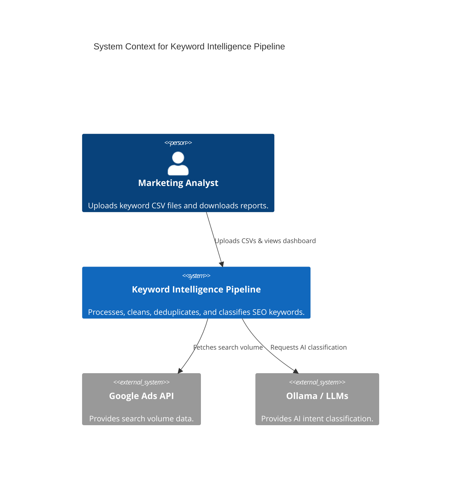
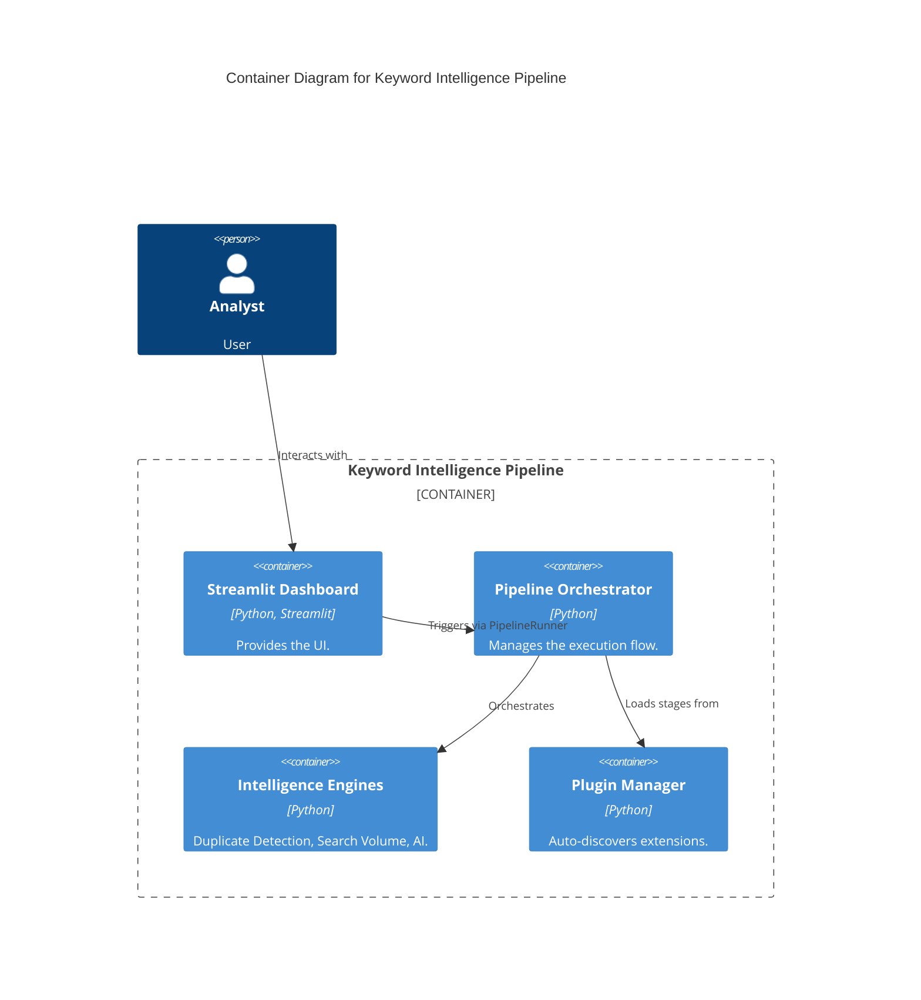

# Keyword Intelligence Pipeline - Documentation

Welcome to the internal documentation for the Keyword Intelligence Pipeline.

## Architecture (C4 Model)

### System Context

### Container Diagram

## Developer Guides
- [Plugin Author Guide](./plugins.md)
- [Troubleshooting](./troubleshooting.md)
