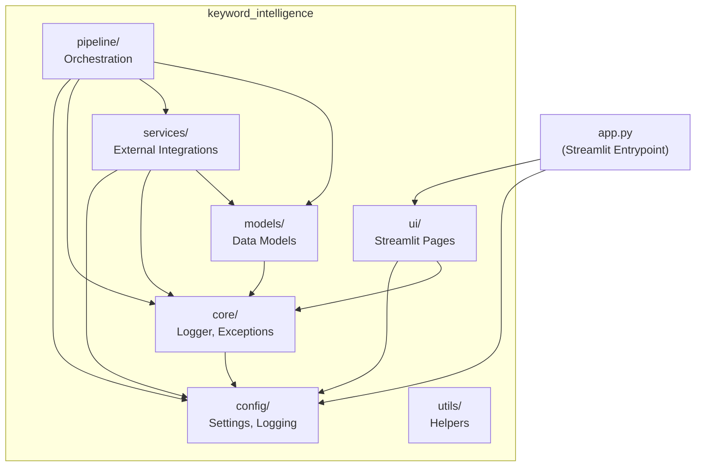
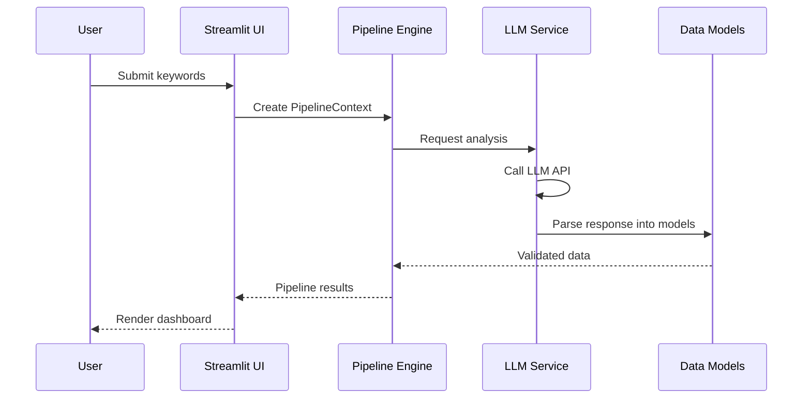

# Architecture

> System architecture documentation for the Keyword Intelligence Pipeline.

## Package Diagram



## Layer Responsibilities

| Layer | Package | Responsibility | Depends On |
|---|---|---|---|
| **Presentation** | `ui/` | Streamlit page rendering, user interaction | config, core, models |
| **Orchestration** | `pipeline/` | Pipeline stage execution, context management | config, core, services, models |
| **Service** | `services/` | External API integrations (LLM, search, DB) | config, core, models |
| **Domain** | `models/` | Pydantic data models, validation | core |
| **Infrastructure** | `core/` | Logger factory, exception hierarchy | config |
| **Configuration** | `config/` | Settings, logging config | *(none — leaf dependency)* |
| **Utilities** | `utils/` | Stateless helper functions | *(none — leaf dependency)* |

## 3. Preprocessing, Normalization & Duplicate Detection Strategy

Data integrity is handled systematically through sequential stages before AI processing begins:

1. **Preprocessing:** Fast vectorized operations to handle null values and standardise data frames.
2. **Keyword Normalization:** An extensible 12-strategy modular framework that executes before duplicate detection. All strategies are deterministic and execute in milliseconds.
   * **Case**: Converts text to lowercase.
   * **Whitespace**: Removes leading/trailing and duplicate spaces.
   * **Unicode**: Normalizes characters (e.g. café -> cafe) and strips invisibles.
   * **Punctuation**: Converts hyphens, slashes, and underscores to spaces.
   * **Dictionary**: Expands standard abbreviations (ergo -> ergonomic).
   * **Company Dictionary**: Overrides standard definitions with brand-specific mappings.
   * **Product Token**: Normalizes product names and specific hyphenations.
   * **Unit**: Collapses spaces before units (2 tb -> 2tb).
   * **Lemmatization**: Applies fast regex stemming (mice -> mouse, batteries -> battery).
   * **Numeric**: Strips leading zeros from numeric components.
   * **Stop Words**: Removes configurable marketing words (best, cheap).
   * **Token Order**: Optionally sorts tokens alphabetically (Disabled by default to preserve search intent).
   * **Separation of Concerns:** 
      * **Why normalization exists:** It standardizes structural variants (e.g., abbreviations, casing, units) prior to semantic matching.
      * **Why deterministic normalization is separate from duplicate detection:** Normalization cleans data deterministically in $O(N)$ time. Duplicate detection handles relational groupings and fuzzy logic ($O(N \log N)$ or higher). Separating them ensures we don't pollute clustering logic with basic string manipulation.
      * **Why semantic similarity belongs later:** Heavy NLP algorithms (embeddings, LLMs) are expensive. Deterministic rules scale easily and aggressively reduce the search space before costly semantic models are invoked.
   * **Stability & Observability:**
      * **Idempotency:** Every strategy guarantees that $f(f(x)) = f(x)$. Applying normalization multiple times is perfectly safe and will not infinitely mutate the string.
      * **Trace & Metrics:** Normalization is a destructive process. The engine strictly records which strategies modified a keyword (`normalization_trace`) and tracks hit rates (`NormalizationMetrics`) to ensure complete auditability and ease of debugging without slowing down the pipeline.
   * **Data Preservation:** The original text is preserved in `original_keyword`, while operations use `normalized_keyword`.
3. **Exact Matching:** Pandas native `drop_duplicates` instantly removes identical strings.
4. **Fuzzy Scoring (RapidFuzz):** Calculates Levenshtein distance scores to identify semantic duplicates (e.g., "laptop lenovo" vs "lenovo laptops"). This handles typos and transpositions that normalization alone cannot fix.
5. **Canonicalization:** Groups similar keywords and elects a "Canonical Keyword" to represent the group, dropping the extraneous variations.

## Dependency Rules

1. **Config and Utils are leaf dependencies** — they depend on nothing internal.
2. **Core depends only on Config** — logger and exceptions may reference settings.
3. **Models depend on Core** — data models may use base exceptions.
4. **Services depend on Config, Core, and Models** — never on Pipeline or UI.
5. **Pipeline depends on everything except UI** — orchestrates services and models.
6. **UI depends on everything except Pipeline internals** — renders data, delegates to pipeline.
7. **No circular dependencies** — dependency graph is a DAG.

## Data Flow



## Dependency Injection Pattern

The application uses **constructor injection** for all service dependencies:

```
Settings (singleton)
    └── injected into → BaseService.__init__(settings)
        └── injected into → PipelineContext(settings, services)
            └── passed to → Stage.execute(context)
```

### How It Works

1. **Settings** is created once via `get_settings()` (cached singleton).
2. **Services** receive `Settings` in their constructor — they never read `os.environ`.
3. **PipelineContext** carries settings + initialized services through the pipeline.
4. **Stages** receive the context and access dependencies through it.

### Benefits

- **Testability**: Mock `Settings` or inject test doubles for any service.
- **Explicitness**: Every dependency is visible in the constructor signature.
- **No globals**: No module-level singletons beyond the `Settings` cache.

## Future LLM Provider Interface

> **Status**: Documented design — implementation deferred to Phase 2.

### Interface Design

```python
class BaseLLMProvider(BaseService):
    """Abstract interface for LLM provider integrations."""

    @abstractmethod
    async def generate(
        self,
        prompt: str,
        *,
        temperature: float | None = None,
        max_tokens: int | None = None,
    ) -> str:
        """Generate a text completion."""

    @abstractmethod
    async def embed(
        self,
        texts: list[str],
    ) -> list[list[float]]:
        """Generate embeddings for a list of texts."""

    @abstractmethod
    async def health_check(self) -> bool:
        """Verify provider connectivity and credentials."""
```

### Provider Implementations (Phase 2+)

| Provider | Class | Model Examples |
|---|---|---|
| Google | `GoogleLLMProvider` | gemini-2.5-flash, gemini-2.5-pro |
| OpenAI | `OpenAILLMProvider` | gpt-4o, gpt-4o-mini |
| Anthropic | `AnthropicLLMProvider` | claude-sonnet-4, claude-haiku |

### Registration Pattern

```python
# In pipeline setup (Phase 2+)
provider = GoogleLLMProvider(settings)
await provider.initialize()
context.register_service("llm", provider)

# In pipeline stages
llm = context.get_service("llm", BaseLLMProvider)
result = await llm.generate(prompt)
```

### Provider Selection

The provider is selected via the `AI_PROVIDER` environment variable:

```
AI_PROVIDER=google → GoogleLLMProvider
AI_PROVIDER=openai → OpenAILLMProvider
AI_PROVIDER=anthropic → AnthropicLLMProvider
```

A factory function resolves the provider class from the string identifier, keeping the pipeline code provider-agnostic.
