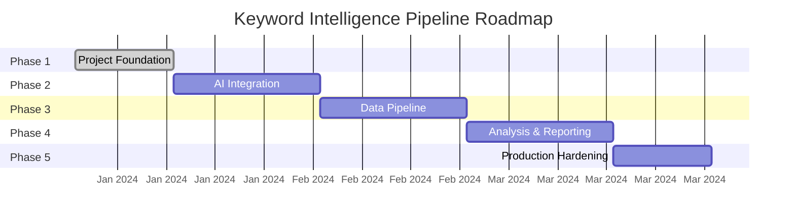

# Roadmap

> Phase-by-phase delivery plan for the Keyword Intelligence Pipeline.

## Phase Overview

---

## Phase 1 — Project Foundation ✅

> **Status**: Complete

- [x] Clean modular folder structure
- [x] Python packaging with `pyproject.toml`
- [x] Typed configuration management (Pydantic BaseSettings)
- [x] Centralized logging with Loguru (console/JSON modes)
- [x] Application exception hierarchy
- [x] Base data model and service abstractions
- [x] PipelineContext architecture design
- [x] Minimal Streamlit dashboard
- [x] Code quality tooling (Black, Ruff, MyPy, pre-commit)
- [x] GitHub Actions CI pipeline
- [x] Cross-platform developer scripts (Makefile + PowerShell)
- [x] Smoke tests and settings tests
- [x] Project documentation scaffolding

---

## Phase 2 — Data Ingestion & Preprocessing

> **Status**: Planned

- [ ] `RawKeywordInput` and `IngestionResult` models
- [ ] `IngestionService` (CSV parsing, raw text input)
- [ ] Data validation and error handling for malformed input
- [ ] `ProcessedKeyword` model (normalized text, word count, etc.)
- [ ] `PreprocessingService` (lowercasing, whitespace trimming, character normalization)
- [ ] Unit tests for ingestion and preprocessing edge cases

---

## Phase 3 — Duplicate Detection & Search Volume

> **Status**: Planned

- [ ] Exact match deduplication
- [ ] Near-duplicate detection algorithms (e.g., Levenshtein, fuzzy matching)
- [ ] Integration with Search Volume APIs (mocked or real)
- [ ] `SearchVolumeService` implementation
- [ ] Metrics caching mechanism

---

## Phase 4 — AI Intelligence

> **Status**: Planned

- [ ] LLM provider interface (`BaseLLMProvider`)
- [ ] Google Gemini / OpenAI provider implementations
- [ ] AI prompt templates for keyword intent, categorization, and clustering
- [ ] AI-powered clustering algorithms
- [ ] Strategic content recommendation generation

---

## Phase 5 — Pipeline Orchestrator & UI

> **Status**: Planned

- [ ] `PipelineContext` implementation to chain stages
- [ ] Pipeline execution tracking, logging, and metrics
- [ ] Interactive Streamlit dashboard for data upload
- [ ] Visualizations for clusters, intent, and volume
- [ ] Report generation (PDF, CSV export)

---

## Phase 6 — Production Hardening

> **Status**: Planned

- [ ] Production deployment configuration
- [ ] Secrets management integration
- [ ] Performance optimization and profiling
- [ ] Comprehensive documentation
- [ ] Security audit & runbook
