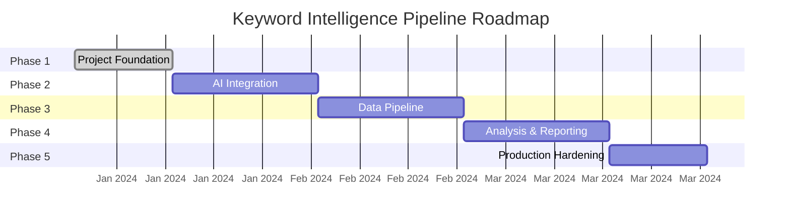

# Roadmap

> Phase-by-phase delivery plan for the Keyword Intelligence Pipeline.

## Phase Overview

---

## Phase 1 — Project Foundation ✅

> **Status**: Complete

- [x] Clean modular folder structure
- [x] Python packaging with `pyproject.toml`
- [x] Typed configuration management (Pydantic BaseSettings)
- [x] Centralized logging with Loguru (console/JSON modes)
- [x] Application exception hierarchy
- [x] Base data model and service abstractions
- [x] PipelineContext architecture design
- [x] Minimal Streamlit dashboard
- [x] Code quality tooling (Black, Ruff, MyPy, pre-commit)
- [x] GitHub Actions CI pipeline
- [x] Cross-platform developer scripts (Makefile + PowerShell)
- [x] Smoke tests and settings tests
- [x] Project documentation scaffolding

---

## Phase 2 — AI Integration

> **Status**: Planned

- [ ] LLM provider interface (`BaseLLMProvider`)
- [ ] Google Gemini provider implementation
- [ ] OpenAI provider implementation (optional)
- [ ] Provider factory with `AI_PROVIDER` env var selection
- [ ] Prompt template management
- [ ] Response parsing and validation
- [ ] Rate limiting and retry logic
- [ ] Provider health checks
- [ ] Integration tests with mock providers

---

## Phase 3 — Data Pipeline

> **Status**: Planned

- [ ] PipelineContext implementation
- [ ] Pipeline stage base class and registry
- [ ] Keyword input ingestion (CSV, API, manual)
- [ ] Search API integrations (Google, SEMrush)
- [ ] Data normalization and validation
- [ ] Intermediate result caching (Redis)
- [ ] Database persistence layer
- [ ] Pipeline execution logging and metrics
- [ ] Data pipeline tests

---

## Phase 4 — Analysis & Reporting

> **Status**: Planned

- [ ] Keyword clustering algorithms
- [ ] Duplicate and near-duplicate detection
- [ ] AI-powered keyword analysis
- [ ] Strategic content recommendations
- [ ] Interactive Streamlit dashboards
- [ ] Report generation (PDF, CSV export)
- [ ] Visualization components (charts, graphs)
- [ ] Analysis accuracy metrics
- [ ] End-to-end integration tests

---

## Phase 5 — Production Hardening

> **Status**: Planned

- [ ] Production deployment configuration
- [ ] Secrets management integration
- [ ] Performance optimization and profiling
- [ ] Error monitoring and alerting
- [ ] User authentication (if required)
- [ ] API rate limit management
- [ ] Comprehensive documentation
- [ ] Load testing
- [ ] Security audit
- [ ] Production runbook
